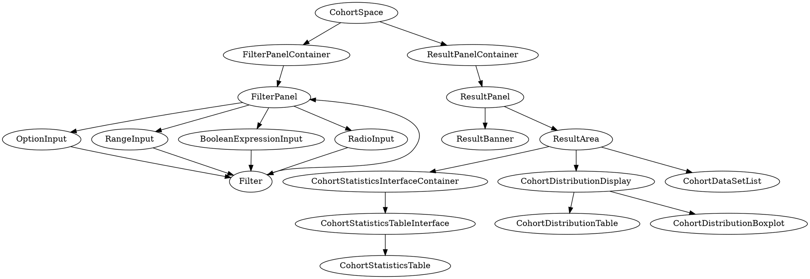

# Arcus Web App

The Arcus web app is envisioned to be the primary non-CLI user interface for the Arcus project, encompassing cohort discovery, catalog searching and management, project workspace management, etc.

The web app is a Single Page App (SPA) written in Javascript using React and Redux. API calls are made to [the Identity and Access Management (IAM) Service](https://github.com/arcus/iam/), also called the "API service" or "gateway".

For development purposes when refining and implementing an API in the web app, you can modify and use `./testserver/testserver.js` (see [Test Server](#test-server) below). This test server was developed is an alternative to relying on the dev API services or even a custom local instance of those services.

The Arcus web app is derived from the LiBI web client (https://github.research.chop.edu/libi/client). This project was bootstrapped using `create-react-app`, which established the directory layout conventions. At some point, we "ejected" the Webpack configuration so we could manually tweak it. We later "un-ejected" it.

## Development

See [Development Environment](#development-environment-and-developer-requirements) at the bottom of this file for comments on the development environment and requirements for being an Arcus developer.

To setup the dev environment, clone the repo and ensure `npm` is installed. Then run the following in the cloned directory. This will take a minute or two.

```
npm install
```

Install Chrome extensions:

- [React DevTools](https://chrome.google.com/webstore/detail/react-developer-tools/fmkadmapgofadopljbjfkapdkoienihi?hl=en)
- [Redux DevTools](https://chrome.google.com/webstore/detail/redux-devtools/lmhkpmbekcpmknklioeibfkpmmfibljd?hl=en)

Install `prettier` for use with your text editor (for example, for [Atom](https://atom.io/), you can use [`prettier-atom`](https://github.com/prettier/prettier-atom)). `Prettier`, using `src/.prettierrc`, will automatically enforce elements of the "Style Guide" section below.

Set an environment variable to allow the client to talk to the IAM service:

- REACT_APP_API_URL: required
  - For development against the Arcus API, use the value `https://arcus.reskubestage.research.chop.edu`.
  - When using the local [mock API server](#test-server) instance, use `http://localhost:8080`.

Then run:

```
npm start
```

View the app at `http://localhost:3000`.

### Testing

The Jenkins server that we use runs `make test`, which excludes a test that uses [Storyshots](https://github.com/storybooks/storybook/blob/master/addons/storyshots/storyshots-puppeteer), an add-on for [Storybook](https://github.com/storybooks/storybook) for visual regression testing. If you would like to run tests including these visual regression tests locally, you can use `npm run test`.

If visual changes to components are detected, the test will fail. Screenshots of failing differences can be found in `src/tests/__image_snapshots__/__diff_output__`. When running `npm run test`, if the differences are all expected, failing screenshots can be updated by pressing the `u` key.

#### React/Redux Tests

React/Redux testing guidelines are [here](https://github.com/reactjs/redux/blob/master/docs/recipes/WritingTests.md). Basically, all the Redux stuff is easy to test because it's all pure functions. Component testing will require [React Testing Library](https://github.com/testing-library/react-testing-library), which tests component behavior, or [Enzyme](http://airbnb.io/enzyme/), which tests for component implementation details and is arguably more brittle. API tests should be written for each endpoint to check that we're still getting the expected payload (how far that reaches is up for debate).

We should look into [Jest snapshot testing](https://facebook.github.io/jest/blog/2016/07/27/jest-14.html).

#### Automated Browser Tests

Tests in `src/tests/selenium.test.js` use [Selenium](https://www.seleniumhq.org/) for automated browser testing.

##### Notes for Writing Selenium Tests

Sometimes, although an element may appear visible/on screen, Selenium will throw an `element is not clickable at point ...` error, or otherwise be unable to find an element. To fix this, try either:

- Reordering the element selection; switching the error-prone action with a later action may solve the problem, or:
- Adding a `wait` statement or `driver.isElementPresent()` call.

### Style Guide

We have settled on the following stylistic decisions (if you use `prettier` as recommended above, you don't need to focus actively on these):

- Use single quotes over double quotes.
- Break lines at approximately 80 characters, except in markdown files, where the limit is not enforced.
- Use trailing commas where [allowed by ES5](https://developer.mozilla.org/en-US/docs/Web/JavaScript/Reference/Trailing_commas) (e.g., in arrays and objects).
- End statements with a semicolon.
- For indenting, use two spaces, rather than a tab character.

`Prettier` can be periodically run on the entire codebase (for example, on all `js` files in the codebase), if desired, using (from the top-level directory of this repository) `prettier --config ./.prettierrc --write "**/*.js"`.

Unused and missing dependencies can be spotted by periodically running `depcheck` using `npx -p depcheck depcheck`.

### <a name="test-server"></a> Testserver

The mock Arcus API server (`testserver.js`) is an optional convenience. During development, if you add API functionality to the web app before the corresponding endpoints are supported by the real API services, you may find it convenient to test the web app against the testserver in `./testserver/`, which handles the new APIs but passes unimplemented requests (that is, the "old", existing ones) to the real API services.

```
# See testserver/README.md
cd testserver && npm install && npm start
```

#### Updating the filter (query) definitions in testserver

The filter definitions are served to the web app by the backend CQS service. The testserver includes its own copy
of these definitions in the `filter-config.yaml` file.

Periodically it is a good idea to update `filter-config.yaml` to keep it in sync with the rendered production version.
The rendered YAML is the payload sent to the web app, not the raw `query-definition.yml` file in the `arcus/cqs`
repository. "But wait!" you say. The payload sent to the client is JSON, not YAML. Here is how to get that configuration
into `filter-config.yaml`:

- Install `js-yaml`: `npm install -g js-yaml` (or you can use the command later via `npx js-yaml`).
- Open the Network tab of the Developer Tools in your browser.
- Reload the Cohort Discovery page.
- Click on the `/query-definition` query in the list of requests in Developer Tools and then on the Response tab.
- Copy the raw JSON response.
- Run that JSON through `js-yaml`. E.g.: `pbpaste | js-yaml > filter-config.yaml`.

### Conceptual flow within the web app

The web app uses a `Redux`-based event stream approach. In this approach, presentational components are not directly acted on or updated in response to actions by the user. Rather, components passively reflect changes to a stream of events, which are called actions. Actions update properties of the app's state (the Redux store). When the app state is updated (i.e., whenever the `dispatch()` function is used in `actions.js` or a container component), the whole page may re-render; in particular, any components that base their presentation on app state properties that change will re-render.

In this approach, information flows through code in multiple files (which are described in more detail in the [Files section](#files) below):

- `components/example/index.js`: The definition of the component itself, which gets its state from the Redux store. The _Redux store gets its initial state from:_
- `state.js`: Defines the initial state of the app in the Redux store. The Redux store _is hooked up to the component via:_
- `containers/example.js`, which also prescribes _actions the component can use, which are defined in:_
- `actions.js`: Defines what "events" are possible to "emit" (i.e., add to the event "stream"). These events are referenced in the container above and `reducer.js` below as `actions.nameOfTheAction`, and _makes use of API calls from:_
- `api.js`: Defines all possible API calls. These are referenced elsewhere as `config.api.example`, _the results of which are dealt with via:_
- `reducer.js`: Defines how exactly to update properties in the app state in response to the actions from `actions.js` above. These property changes _are reflected by:_
- `components/example/index.js`, cycling back to the beginning of this list.

### Developer workflow

- Determine the feature you want to introduce.
- Sketch out the design on paper or digitally.
- Break up the design into hierarchies of components (draw boxes). Top-level container components pass state from the Redux store to presentational components in the form of React props.
- For each component:
  - Determine what state (if any) is required.
  - Does it overlap with existing state in `state.js`?
  - Can a user alter that state by clicking on things?

You should perform the following tasks when implementing a new feature:

- Identify any gateway endpoint API changes, perhaps prototyping in the test server code. The API is defined in the [arcus/iam repo](https://github.com/arcus/iam/).
- Write API access function(s) in `api.js`.
- Create default state, if any, in `state.js`. If an action resets a state section back to the initial value, define a `const` variable for that value, export it, and use it both in the reducer and the construction of the complete initial state in `state.js`.
- Create/edit function(s) in `actions.js`.
- Create/edit subreducer(s) in `reducer.js` and add to the top-level reducer.
- Add container components under `containers/`.
- Add presentational components under `components/`, each defined in an `index.js` file in a mnemonically-named directory.
- Add styles specific to a component next to the component source file in a `style.module.css` file.
- Add tests as needed.
- Add a React Storybook story (see below) for non-trivial components.

In any case in which a change to the web app code is a breaking change to the names of Redux store elements that are saved to `localstorage`, `params.localStorageVersion` in `config.js` should be incremented. This will cause the web app to discard all saved `localstorage` elements related to the web app, preventing the app from crashing.

### Files

Frequently edited files:

| File                                                  | Comments                                                                                                                                                                                                                                                                                                                                                                                                                                                                                                                                                                                                     |
| ----------------------------------------------------- | ------------------------------------------------------------------------------------------------------------------------------------------------------------------------------------------------------------------------------------------------------------------------------------------------------------------------------------------------------------------------------------------------------------------------------------------------------------------------------------------------------------------------------------------------------------------------------------------------------------ |
| `api.js`                                              | Implements functions to access the gateway API. This should only be used by the action creators and not directly by components.                                                                                                                                                                                                                                                                                                                                                                                                                                                                              |
| `actions.js`                                          | Contains action types and action creators that are dispatched through Redux. We will follow this [convention](https://github.com/acdlite/flux-standard-action#flux-standard-action) for the structure of the action object. For any action creators that require a remote call, use [async action creators](http://redux.js.org/docs/advanced/AsyncActions.html#async-action-creators). You can see an example in [`actions.js`](./src/actions.js). Basically it is a function that returns a function that takes `dispatch` as an argument so actions can be dispatched when the async operation completes. |
| `reducer.js`                                          | Contains reducers which take an action object, the existing state, and returns the new state given that action. You can see the signature and more details [here](http://redux.js.org/docs/basics/Reducers.html#handling-actions). Reducers can be localized to sub-objects of the state object. You can see how this works in the `rootReducer` function.                                                                                                                                                                                                                                                   |
| `state.js`                                            | Defines the single base state object. All reducers operate on some subset of the state object. So adding new state should be properly namespaced. For local component state this can be organized by component. For more general shared state (remote data) this could be organized by data types.                                                                                                                                                                                                                                                                                                           |
| `containers/*.js`                                     | React container components used to pass props to presentational components in response to changes to the Redux store.                                                                                                                                                                                                                                                                                                                                                                                                                                                                                        |
| `components/FOOCOMPONENT/{index.js,style.module.css}` | React presentational components.                                                                                                                                                                                                                                                                                                                                                                                                                                                                                                                                                                             |

Other files of note:

| File                        | Comments                                                                                                                                                                                                     |
| --------------------------- | ------------------------------------------------------------------------------------------------------------------------------------------------------------------------------------------------------------ |
| `Caddyfile`                 | Config file for Caddy, the web server we use for serving the app.                                                                                                                                            |
| `Dockerfile`                | Recipe for building a Docker container that will run Caddy and serve the app.                                                                                                                                |
| `Dockerfile.dev`            | Recipe for building a reproducible development environment for the web app                                                                                                                                   |
| `Dockerfile.build`          | Recipe for building a Docker container with Go that can be used to build the app reproducibly.                                                                                                               |
| `Jenkinsfile`               | Config file instructing the Jenkins CID server to build and maybe deploy the app upon Github pushes.                                                                                                         |
| `Makefile`                  | Describes how to build, test, and version the app.                                                                                                                                                           |
| `README.md`                 | This file.                                                                                                                                                                                                   |
| `build/`                    | Build artifacts are placed here.                                                                                                                                                                             |
| `node_modules`/             | Over a thousand modules of dependency goodness.                                                                                                                                                              |
| `package-lock.json`         | Manifest of dependencies with actual versions.                                                                                                                                                               |
| `package.json`              | Package and dependency definition.                                                                                                                                                                           |
| `public/`                   | (only files in here can be used by public/index.html)                                                                                                                                                        |
| `public/index.html`         | The top-level HTML page template file that will have the root React component (prepared by src/index.js) injected into it.                                                                                   |
| `scripts`/                  | Scripts used by `package.json` as well as runtime scripts (see `Dockerfile`).                                                                                                                                |
| scripts/`entrypoint.sh`     | Used by the `Dockerfile` as the container entrypoint script; this script takes runtime configuration variables passed via the container's environment and interpolates them into the Javascript bundle file. |
| src/`app.js`                | Overall structure of the application, e.g. global nav and body.                                                                                                                                              |
| src/`config.js`             | Configuration constants.                                                                                                                                                                                     |
| src/`index.js`              | Bootstraps the app and mounts the top React component. Determines which state sections are saved to and restored from local browser storage.                                                                 |
| src/`index.css`             | Global css. We try to minimize this, making use of locally-scoped CSS Modules instead.                                                                                                                       |
| src/`root.js`               | Boilerplate wrapper to inject store, history, and routes. This is the top-level React component, created by src/index.js and inserted into `public/index.html`.                                              |
| src/`store.js`              | Boilerplate to initialize the Redux store and include middleware.                                                                                                                                            |
| src/`app.module.css`        | Styling for app.js.                                                                                                                                                                                          |
| src/`persister.js`          | Module for persisting a subset of the state to `localStorage`. The subsections to persist are listed in `stateKeys` in `src/index.js`.                                                                       |
| src/`stories/*.stories.js`  | Storybook "stories" for manually verifying the behavior and appearance of presentational components with pre-defined props.                                                                                  |
| testserver/`Dockerfile.dev` | Recipe for building a reproducable development environment for the test server                                                                                                                               |

### Logical Component Hierarchy

#### CohortSpace

Here is an excerpt of the app's logical React component hierarchy under the `CohortSpace` component, as of 3/14/2019:


##### CohortSpace diagram source

Source code for the above diagram:



To rebuild the `README-cohort-space.png` diagram image, render the DOT format using `dot`:

- `brew install graphviz`
- Copy DOT language to the clipboard.
- `pbpaste | dot -Tpng > README-cohort-space.png`

### Storybook

React Storybook stories provide a way of visually testing a component with a set of props.

Non-trivial presentational components should have stories files in `./stories/` named `*.stories.js`. Use existing files as guides. See `src/stories/README.md`.

### Live debugging and component development

In the Chrome React plugin, you can edit the props of a component and the component will re-render:


This allows you to do _in situ_ what Storybook stories do in isolation.

### Running in production mode locally

The following recipe builds a Docker image and runs it on `localhost:3000`.

```
make dist-builder && make dist && make image
docker run --rm -d -p 3000:80 -e API_URL=https://arcus.reskubestage.research.chop.edu -e GCP_PROJECT_ID=__GCP_PROJECT_ID__ -e STACKDRIVER_API_KEY=__API_KEY__ -e SERVICE=webApp -e SERVICE_VERSION=dev-$USER `docker images -q | head -1`
```

- Note that if you supply valid `__GCP_PROJECT_ID__` and `__API_KEY__` values above, then any unhandled Javascript errors will be reported to the Google Cloud Stackdriver error reporting service for the specified project.
- If you do **not** supply valid values for those environment variables, then no error reporting will occur.
- The given `SERVICE_VERSION` will show up in the error logs as, e.g. `dev-murphyke`. You can make that whatever you want, e.g. the image ID.
- If you want to hit the `testserver` instead of the actual API server, substitute `http://localhost:8080` for `https://arcus.reskubestage.research.chop.edu`.

### Forcing error reporting in development

Stackdriver error reporting does not occur in development mode. To force it to be used, modify the options to `errorHandler.start` in `src/error-handler.js`.

Refer to the environment variables (`GCP_PROJECT_ID`, `STACKDRIVER_API_KEY`, `SERVICE`, and `SERVICE_VERSION`) mentioned in the [Deployment](#deployment) section below.

You should create and use a test project in the GCP sandbox to avoid polluting the production error logs. As per https://github.com/GoogleCloudPlatform/stackdriver-errors-js, enable the Stackdriver error reporting API on your project and generate an API key. `SERVICE` and `SERVICE_VERSION` can be whatever you want.

Make sure to set the `errorHandler.start`'s `disabled` option to `false` in order to turn on error reporting.

## Deployment

In production, literal `{{.Env.SOME_ENV_VAR}}` values in the Javascript source must be replaced with the appropriate values, e.g. by Caddy server templating. The Docker container handles this automatically, as long as the following environment variables are passed to the container when running it:

- `API_URL` - corresponds to `REACT_APP_API_URL` in development.
- `GCP_PROJECT_ID`
  - Use the project ID of the project containing the Stackdriver error reporting API service to which to report errors. See https://github.com/GoogleCloudPlatform/stackdriver-errors-js.
- `STACKDRIVER_API_KEY`
  - See https://github.com/GoogleCloudPlatform/stackdriver-errors-js.
- `SERVICE`
  - Use the value `webApp`. For use in Stackdriver error reporting. This service identifier will distinguish the web app's errors from those of other services.
- `SERVICE_VERSION`

  - Use the short Git commit hash of the deployed web app code.

  Note that Docker images are tagged with one or more tags:

  - `quay.research.chop.edu/arcus/web:COMMIT`
  - `quay.research.chop.edu/arcus/web:latest` (for `master`)
  - `quay.research.chop.edu/arcus/web:BRANCH_NAME` (for a non-`master` branch)

See `Makefile` and `Jenkinsfile`.

The deployment details are handled along with the rest of the Arcus services.

### Error reporting

The following errors are reported:

- Backend API error responses of 4XX.
- Almost all unhandled Javascript errors; all except those that occur within the lowest-level `fetch` processing. It's not worth obfuscating these small and stable bits of code with special try/catch handling in order to distinguish between errors in this code and errors raised by `fetch`.

The following errors are NOT reported:

- Backend API error responses outside the 4XX range; the presumption is that these errors will already have been logged.
- Network connectivity errors; i.e. any errors that occur within `fetch` or the `fetch` handling code.

### Viewing Stackdriver error reports

Go to https://console.cloud.google.com/errors and choose the relevant project from the dropdown menu in the title bar.

### Release

TBD, but see `Makefile` and `Jenkinsfile`.

## Development Environment and Developer Requirements

### Training/learning

- CITI training - mandatory for dealing with data for human subjects research/PHI

### Account creation/granting of access

- Internal Github
  - https://github.research.chop.edu
  - Login with your CHOP AD credentials to create an account automatically
- Public Github
- Slack DBHi team
- Stories on board

### State of Arcus

- See the [Arcus `planning` repository's Readme](https://github.com/arcus/planning/blob/master/README.md)
- Pre-implementation storyboard:
  - For Arcus Alpha: https://choparcus.storiesonboard.com/m/arcus-alpha-january-2019-release/!card/Z9UdVZAKWZwfvznpws5Lbw
  - For Arcus overall: https://choparcus.storiesonboard.com/m/arcus
- Implementation kanban board: https://github.com/orgs/arcus/projects/12

### Learning

- Docker
  - https://docs.docker.com/get-started/
  - https://docs.docker.com/docker-for-mac/install/
- Domain driven design
  - https://en.wikipedia.org/wiki/Domain-driven_design
  - https://dev.to/barryosull/domain-driven-design-for-everyone-else-a9
  - https://www.culttt.com/2014/11/12/domain-model-domain-driven-design/
  - https://vaughnvernon.co/?p=838
- Event sourcing
  - https://dev.to/byronruth/event-sourcing-distilled-ea5
- CQRS
  - http://cqrs.nu/Faq
- React
  - https://reactjs.org
- Redux
  - https://redux.js.org
- Go
  - This is used for backend services that the web app talks to.
  - https://golang.org/doc/, especially:
    - https://golang.org/doc/effective_go.html
    - https://tour.golang.org/welcome/1

## dewr

The web project has been set up to suport development inside docker using [dewr](https://github.com/chop-dbhi/dewr). This let us transmit the state of the development enviroment to other devs.

### dewr setup

Steps to bring up a dewr environment are:.

1. If you've been running on mac, move aside (or delete) your `node_modules` folders in `/` and `/testserver` (we need linux versions of some packages)
1. Bring up the dewr network with `dewr network up`
1. In the top level of this project run `dewr build && dewr run bash` or `make dev-env`
1. Install linux version of the dependencies with `dewr run npm install`
1. In that terminal, start the webapp with `dewr run npm start`
1. In another terminal, run `docker exec -it web bash` and run `npm run storybook`
1. In yet another terminal, do `cd testserver && dewr build && dewr run npm install && dewr run npm start` to bring up the testserver

This should result in the named `web` and `testserver` containers on a network called `dewr`.

Confirm this with `docker network inspect dewr`.

<a name="dewr-warning"></a>

Be cautious with switching operating systems, i.e. you should maintain and use `node_modules` either natively *or* with `dewr`. Chromedriver requires some C++ binaries and they are not interchangable between linux and mac. Your tests may fail if you run chromedriver on the wrong OS.

It's also useful to have these lines in /etc/host if we want to interact with pages manually.

```
127.0.0.1 web
127.0.0.1 testserver
```

We now have routing from the web browser to appropriate containers and the ability for tests to hit any of the three endpoints (webapp, storybook, testserver). **You should now access the web app in the browser at http://web:3000, rather than http://localhost:3000,** to avoid CORS errors with the testserver.

Remember to keep the `Dockerfile.dev` files up to date and inform the team when they should rebuild.

### Testing in dewr

Following the steps in the setup section we can now run tests against the test server, webapp and storyshots. In a fresh terminal do:

1. `docker exec -it web bash`
2. `make test` is whats called by the CI job (as of now, just unit tests)
3. `npm run test_noStorybookCheck` calls the selenium and storybook tests

New changes should be tested and the tests should pass on both mac and linux. (in and out of docker) See the [writting tests](#writtingtests) section for more.

### Enviromental variables in docker/dewr

All of these variables default to localhost:port. It's assumed that no values need to be supplied
to run any of the services and they will all assume localhost with their particular port.

| name                    | Comments                                                                                                                                                                                                                                                             |
| ----------------------- | -------------------------------------------------------------------------------------------------------------------------------------------------------------------------------------------------------------------------------------------------------------------- |
| `REACT_APP_API_URL`     | same as we've had for the react app, should point to the testserver or the arcus api.                                                                                                                                                                                |
| `REACT_APP_CATALOG_URL` | defaults to http://localhost:8080/api/catalog/v1/ but can be mapped to the test server or an actual elasticsearch endpoint. in the dewr dockerfile we expect an instance of the testserver to be running on testserver:8080. See the dockerfile for it's definition. |
| `STORYBOOK_URL`         | url for the storyshorts tests so they understand where to call home to..                                                                                                                                                                                             |
| `TEST_ROOT_URL`         | a url for the selenium tests. set to web:3000 for the dewr environment.                                                                                                                                                                                              |

In testserver/Dockerfile.dev

| name                    | Comments                                                                                                                                                             |
| ----------------------- | -------------------------------------------------------------------------------------------------------------------------------------------------------------------- |
| `REACT_APP_ORIGIN`      | the origin for requests to the testserver from pages served by the web app.                                                                                          |
| `STORYBOOK_ORIGIN`      | url for the storyshorts tests so they understand where to call home to..                                                                                             |
| `TEST_ROOT_URL`         | a url for the selenium tests. set to web:3000 for the dewr environment.                                                                                              |
| `TESTSERVER_LISTEN_URL` | the same as the --listen-url parameter in the test server. made into an environmental variable for consistency. also need to be not localhost for some environments. |

### Setting up

Here is one possible recipe for installing prerequisite development software:

- On Mac OS, install **Homebrew**.

  - Install **git**.
    - Configure with an existing `.gitconfig`, `.gitignore_global`, etc, if any.
  - Install **node.js** (and **npm**).

    - One way: install **nvm**

      - Then add to shell startup:

              export NVM_DIR="$HOME/.nvm"
              . "/usr/local/opt/nvm/nvm.sh"

      - Install `node.js` (I'm using stable/long-term-support): `nvm install --lts node`

- _If_ you will be manually creating and pushing Docker images, running a 'dewr' enviroment or running Arcus servers in containers, install **Docker**, e.g. from https://store.docker.com/search?q=&type=edition&offering=community.
- Clone https://github.com/arcus/web.
- Define the `REACT_APP_API_URL` environment variable (see above).
- `npm install && npm start`

## docker-compose

As an alternative to [Dewr](#dewr), you may instead use [`docker-compose`](https://docs.docker.com/compose/install/) to start the web app, the testserver, and the Storybook service all at once.

1. Add the following to `/etc/hosts`:

   ```
   127.0.0.1 web
   127.0.0.1 testserver
   127.0.0.1 storybook
   ```

1. Run `docker-compose up` to start the suite.
    - This runs in the foreground, so you can see when the containers are done starting up.
    - Just hit control-C to stop all services.
        - The logs are still accessible in the individual stopped containers (i.e. the containers are not removed).
    - The logs of all services are messily interleaved in your terminal.
        - ... but you can always use `docker logs CONTAINER_NAME` to view the logs for a single service. (`docker ps` shows running containers, `docker ps -a` shows stopped containers also).
    - Alternative: run in background with `docker-compose up -d` and stop with `docker-compose down`.
        - Minor detail: `docker-compose down` stops the containers *and* removes them.
1. It takes a long time for the services to start up.
    - It takes a **very** long time for the services to start up the very first time (as packages are installed).
    - After the initial run, the web container's `node_modules` is cached in a Docker volume, so subsequent runs are much faster.
1. The web app is at `http://web:3000`.
    - As with Dewr, **you should access the web app in the browser at http://web:3000, rather than http://localhost:3000,** to avoid CORS errors with the testserver.
1. The Storybook service is at `http://storybook:9009`. **Warning**: `web:9009` will appear to work, but stories that talk to the testserver will not render properly.
1. You can run a shell inside the web container with `docker exec -it web_web_1 bash`.
    - For instance, you would do this to do a manual `npm install` after updating `package.json`.
1. Note that the web and storybook containers share the same `node_modules` directory.
    - This is stored as a [persistent named Docker volume](https://docs.docker.com/storage/volumes/).
    - **Keep in mind**: this `node_modules` directory is **not** the local `node_modules` directory created by running `npm install` natively or within a `dewr` container ([never mix the latter, BTW](#dewr-warning)). It is owned by Docker and can only be maintained from within the containers. 
